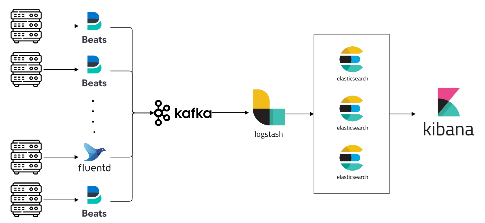

# elk-playground

log pipeline system w/ ELK stack

---



Filebeats -> Kibana -> Logstash -> Elastic Search -> Kibana

- Elastic Search 3대 클러스터 구성
- Filebeats, fluentd 등의 로그수집기 대응
- Kafka 연동

---

## TODO

- [x] 단일 형태의 ELK stack 구성 테스트
  - [x] custom ingest pipeline w/ filebeat
- [x] Elastic Search Cluster 구성 테스트
  - [x] Elastic Search 3대 클러스터 구성
  - [x] Kibana 연동
  - [x] Logstash 연동
    - [x] custom ingest pipeline w/ filebeat
- [x] Kafka 연동
  - [x] filebeat -> kafka -> logstash -> elastic search -> kibana

---

## Usage

```bash
make build
make dev
make topic TOPIC=my-topic
make produce TOPIC=my-topic
make consume TOPIC=my-topic
```
